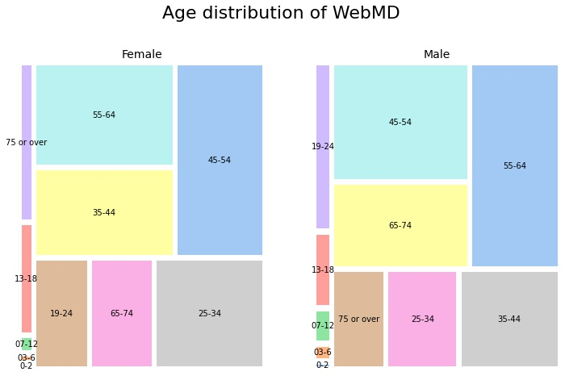
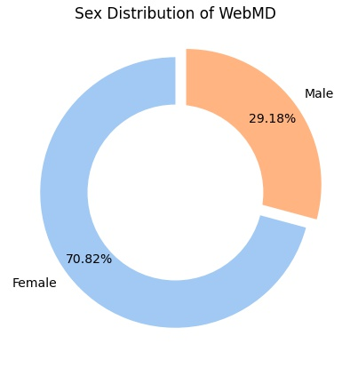
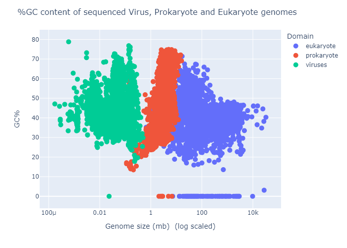

# PYTHON Portfolio as a biotechnology engineer
Welcome to my portfolio and thanks for your consideration by reading it 

I learned how to program by self-learning Python and SQL, as my background is more related towards engineering and biotechnology. I believe that Python is a powerful tool and I found it really useful to apply it into computational biology and data science. I have a solid understanding of Python but I'm still doing an effort to have an advance knowledge for powerful machine learning and statistical analysis.

With this portfolo I want to show my abilities of ETL, exploratory analysis, data visualization, machine learning and statistics. I will be using basic libraries such as numpy, pandas, seaborn, and scikitlearn. I have included 3 projects which will help to showcase my abilities

I am also proud to say that I have strong critical-thinking and problem-solving skills even though I can recognize that my programming skills can be improven. With this being said I believe to be an ideal candidate for the Bioengineering program at KAUST as I am motivated into programming and biology.

## WebMD drugs user experience
**Code:** [`WebMD`](https://github.com/kuiros7/PORTFOLIO/blob/main/WebMD/WEBMD.ipynb) 
**Skills:** ETL, Data Visualization (Seaborn, Pandas, NumPy, Squarify)

My first project consists of a WebMD reviews dataset in which consisted of 300k entries of drugs with some scores. My goal was to visualize how does Condition feature relates towards the given scores and see which of them have a better reception and effect on the user.  
  The things I considered is that there is a bias into women entries and that condition has a lot of unique values, so I had to change the dataframe for me to be easier to obtain conclusions.

  
   

My final result was obtaining a heatmap to show the mean scores of effectivenes, ease of use and satisfaction. A first to thing to notice is how overall Ease of use is not a problem between conditions, satisfaction may vary but overall also has a good score. The difference comes with client Satisfaction as some them have really low scores like Ostheoporosis, Birth Control and Pressure conditions.  

## GC content of genome 
**Code:** [`GC content`](https://github.com/kuiros7/PORTFOLIO/blob/main/Biostatistics/GC%20content.ipynb) 
**Skills:** Basic statistics (Plotly)

The next project of a basic analysis of GC content from genome sequences of eukaryote, prokaryote and virus organisms from NCBI. First plot is a violin plot in which I concluded that the GC% content does not vary on eukaryote and viruses. But on the case of prokaryote the results differs from the other groups. 
 
Finally a scatter plot was built to compare the how does domain affects into the size of genome and the effect on GC content, size needed to be in log notation for a better plotting. 
 

## Novozyme stability
**Code:** [`Novozyme`](https://github.com/kuiros7/PORTFOLIO/blob/main/Novozyme/NOVOZyme.ipynb
)  
**Skills:** Machine Learning (Sklearn, graphviz, pandas)  

This project was based on a Novozyme competition to predict the stability of enzymes given a set of values and the model of one enzyme. This was the most challenging project as I don't have an strong background on Machine Learning algorithms and modeling predictions but I wanted to give it a try as it's the field wich interest me the most. I based most of my coding on other Kaggle participants which helped learn to understand how to implement and interpret a lot of algorithms. 
I took a main reference from this [`code`](https://www.kaggle.com/code/cdeotte/public-lb-1st-place-solution/notebook) as they implement random forest and hill climbing.

#### Other projects:
[`Web scraping of Virus families with BeautifulSoup`](https://github.com/kuiros7/PORTFOLIO/blob/main/Other%20projects/Viruses.ipynb)  
[`Avocado consumption in US analysis`](https://github.com/kuiros7/PORTFOLIO/blob/main/Other%20projects/Avocado%20consumption%20in%20US.ipynb)  
[`Mental Fatigue scores analysis`](https://github.com/kuiros7/PORTFOLIO/blob/main/Other%20projects/Mental%20Fatigue%20Scores.ipynb)  

My next goals are to being able to properply scrape relevant data, and use more powerful algorithms to make predicitions and models.

Thanks a lot for taking the time to read throughout my portfolio, and hope we can reach any time soon.

## Contacts
- LinkedIn: [AndresAlanis](https://www.linkedin.com/in/andresalanisquiroz/)
- Email: alanisq68@gmail.com
