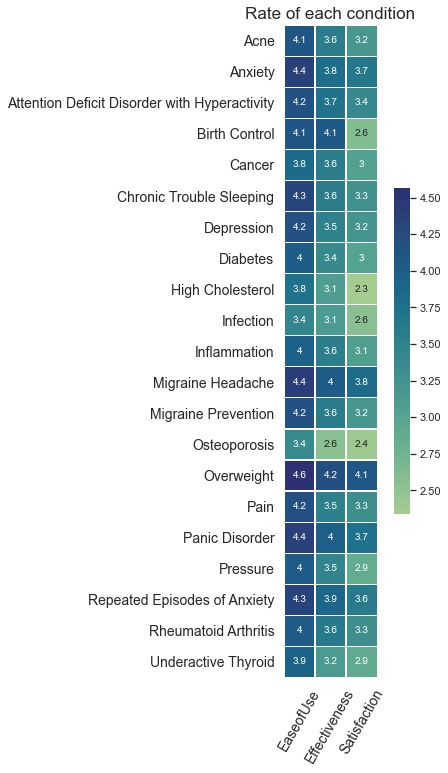

# PYTHON Portfolio as a biotechnology engineer
Welcome to my portfolio and thanks for your consideration by reading it 

I learned how to program by self-learning Python and SQL, as my background is more related towards engineering and biotechnology. I believe that Python is a powerful tool but I found it really useful for me to apply it into computational biology and data science. I have a solid understanding of Python but I'm still doing an effort 

With this portfolo I want to show my abilities of ETL, exploratory analysis, data visualization, machine learning and statistics. I will be using basic libraries such as numpy, pandas, seaborn, and scikitlearn. I have included 3 projects which will help to showcase my abilities

I am also proud to say that I have strong critical-thinking and problem-solving skills even though I can recognize that my programming skills can be improven. With this being said I believe to be an ideal candidate for the Bioengineering program at KAUST as I am motivated into programming and biology.

## WebMD drugs user experience
**Code:** [`WebMD`](https://github.com/kuiros7/PORTFOLIO/blob/main/WEBMD.ipynb) 
**Skills:** ETL, Data Visualization, Functions, Converting Types

My first project consists of a WebMD reviews dataset in which consisted of 300k entries of drugs with some scores. My goal was to visualize how does Condition feature relates towards the given scores and see which of them have a better reception and effect on the user.  
  The things I considered is that there is a bias into women entries and that condition has a lot of unique values, so I had to change the dataframe for me to be easier to obtain conclusions my final result was obtaining a heatmap to show the scores of effectivenes, ease of use and satisfaction.

## Novozyme stability
**Code:** [`Novozyme`](https://github.com/kuiros7/PORTFOLIO/blob/main/NOVOZyme.ipynb)  
**Skills:** Machine Learning 

This project was based on a Novozyme competition to predict the stability of enzymes given a set of values and the model of one enzyme. This was the most challenging project as I don't have an strong background on Machine Learning algorithms and modeling predictions but I wanted to give it a try as it's the field wich interest me the most. I based most of my coding on other Kaggle participants which helped learn to understand how to implement and interpret a lot of algorithms.

## Biostatistics
**Code:** [`Biostatistics`](https://github.com/kuiros7/PORTFOLIO/blob/main/WEBMD.ipynb) 
**Skills:** 

My next goals are to being able to properply scrape relevant data, and use more powerful algorithms to make predicitions and models.

Thanks a lot for taking the time to read throughout my portfolio, and hope we can reach any time soon.

## Contacts
- LinkedIn: [@tiannaparris](https://www.linkedin.com/in/tianna-parris-9b6823176/)
- Email: alanisq68@gmail.com

[https://img.shields.io/badge/LinkedIn-0077B5?style=for-the-badge&logo=linkedin&logoColor=white]
